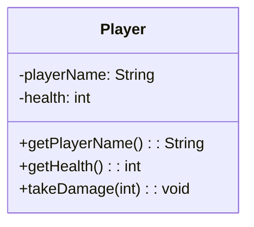
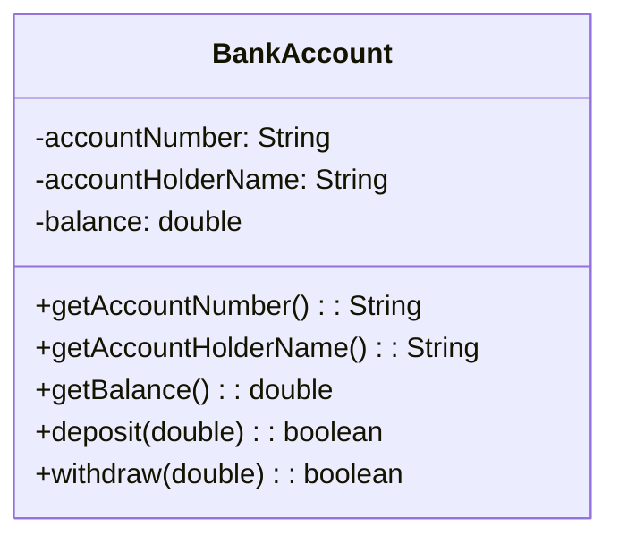
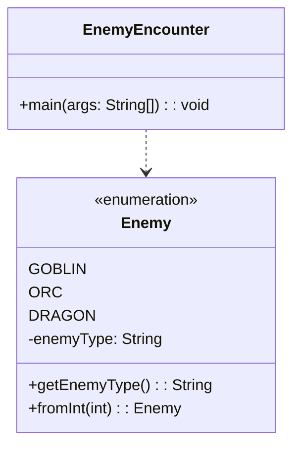
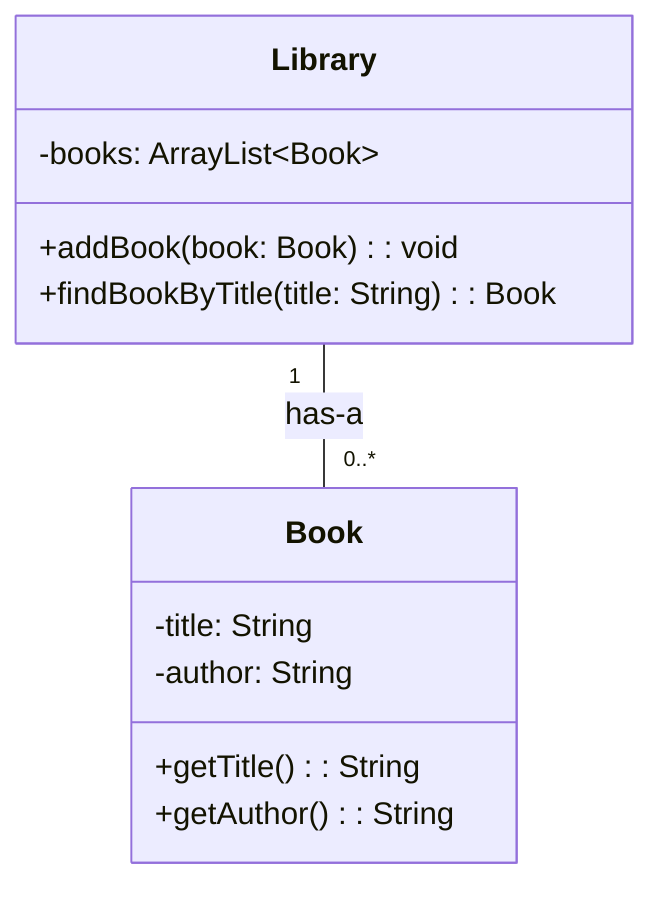
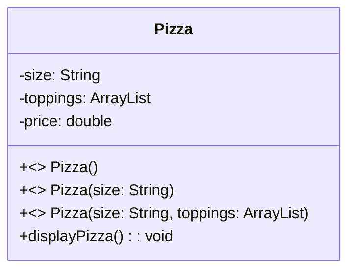
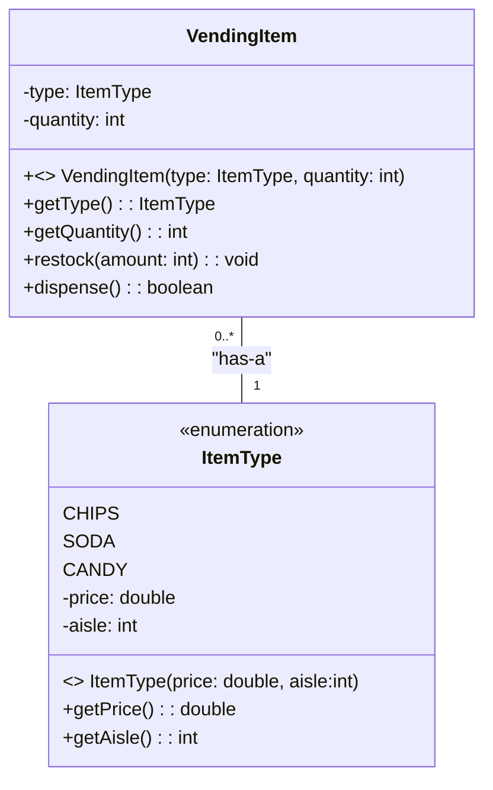
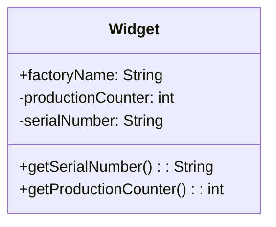
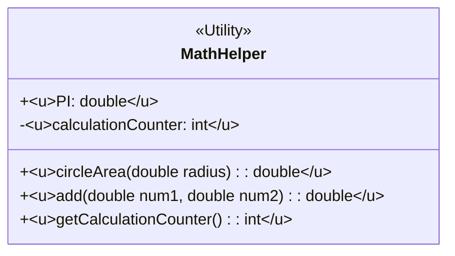

# reviewHangMan

### Player

```mermaid
classDiagram
    class Player{
        -playerName: String
        -health: int
        +getPlayerName(): String
        +getHealth(): int
        +takeDamage(int): void
    }
```

### Bank Account

```mermaid
classDiagram
    class BankAccount{
        -accountNumber: String
        -accountHolderName: String
        -balance: double
        +getAccountNumber(): String
        +getAccountHolderName(): String
        +getBalance(): double
        +deposit(double): boolean
        +withdraw(double): boolean
    }
```

### Enemy Encounter:

```mermaid
classDiagram
    class Enemy{
        <<enumeration>>
        GOBLIN
        ORC
        DRAGON
        -enemyType: String
        +getEnemyType(): String
        +fromInt(int): Enemy
    }
    
    class EnemyEncounter{
        +main(args: String[]): void
    }
    
    EnemyEncounter ..> Enemy
```

### Library :

```mermaid
classDiagram
    class Book {
        -title: String
        -author: String
        +getTitle(): String
        +getAuthor(): String
    }

    class Library {
        -books: ArrayList~Book~
        +addBook(book: Book): void
        +findBookByTitle(title: String): Book
    }

    Library "1" -- "0..*" Book : has-a
```

### Pizza

```mermaid
classDiagram
    class Pizza{
        -size: String
        -toppings: ArrayList<String>
        -price: double
        +<<constructor>> Pizza()
        +<<constructor>> Pizza(size: String)
        +<<constructor>> Pizza(size: String, toppings: ArrayList<String>)
        +displayPizza(): void
    }
```

### Vending Machine

```mermaid
classDiagram
    class ItemType {
        <<enumeration>>
        CHIPS
        SODA
        CANDY
        -price: double
        -aisle: int
        <<constructor>> ItemType(price: double, aisle:int)
        +getPrice(): double
        +getAisle(): int
    }
    class  VendingItem {
        -type: ItemType
        -quantity: int
        +<<constructor>> VendingItem(type: ItemType, quantity: int)
        +getType(): ItemType
        +getQuantity(): int
        +restock(amount: int): void
        +dispense(): boolean
    }
    VendingItem "0..*" -- "1" ItemType : "has-a"
```

### Widget Factory

```mermaid
classDiagram
    class Widget {
        +factoryName: String
        -productionCounter: int
        -serialNumber: String
        +getSerialNumber(): String
        +getProductionCounter(): int
    }
```

### Math Helper

```mermaid
classDiagram
    class MathHelper {
        <<Utility>>
        +<u>PI: double</u>
        -<u>calculationCounter: int</u>
        +<u>circleArea(double radius): double</u>
        +<u>add(double num1, double num2): double</u>
        +<u>getCalculationCounter(): int</u>
    }
```